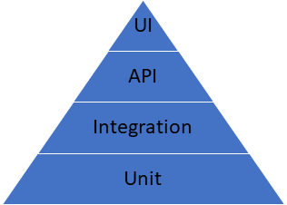

# Automated testing 

There are two kinds of testing in the world of software — **manual** and **automated**.

You can do other kinds of testing, like *regression testing* and *functional testing*, manually, but it’s a fairly
wasteful practice for humans to keep doing the same thing over and over again. It’s these kinds of repetitive tests that
lend themselves to **test automation**.

Test automation, or automated testing, is the practice of running *tests automatically*, *managing test data*, and
utilizing results to *improve software quality*.

It’s primarily a *quality assurance* measure, but its activities involve the commitment of the entire software
production team.

## How Automated testing improves productivity

The **Goal of Automation** is to *reduce* the number of test cases to be run manually. A professional automated testing
software can be seen as a solution to a common problem: how to produce *high-quality*, *robust* and *reliable software*
with ever-growing complexity with technology under massive competitive pressure.

In fact, automated software testing provides a cost-effective solution to this problem.

Automated software testing improves business results in three ways:

**Increased test efficiency**

This affects average number of tests you can run for an hour of tester time. Higher testing efficiency drives down
*product development time and costs*, improving your bottom line.

**Testing effectiveness**

This affects the rate at which your testing technology reveals bugs before your systems are released. Increased
effectiveness reduces costs through a better product, by building *customer satisfaction and loyalty*.

**Shorted time to market**

If your company sells software products that must be tested before release, reducing your time to market can yield
enormous benefits. Replacing manual testing with automated testing can *cut weeks or months* from elapsed testing time.

## How to implement a test automation strategy

The test automation pyramid strategy calls for automating tests at three different levels.

**Unit testing** represents the base and biggest percentage of this test automation pyramid. Then integration, then,
service layer, or **API testing**. And finally, **GUI** tests sit at the top.

The pyramid looks something like this:

