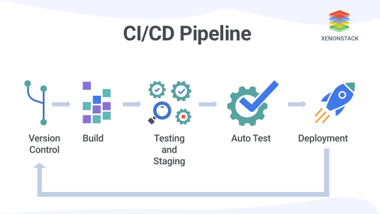

# Continuous integration 

**Continuous integration**, or shortened to **CI**, is a *valuable and well-established practice* in modern software
engineering organizations.

Using CI enables software development tasks to be developed *independently* and in *parallel* among developers.

## How to use

The foundational **dependency** of CI is a *version control system* (VCS). Once version control is in place, finding a
version control **hosting platform** is the next move.

Most modern version control hosting tools, such as **Bitbucket**, **Github**, and **Gitlab**, have support and features
built in for CI.

After version control has been established, integration approval steps should be added.

Once you have a version control system setup with some merge approval steps in place, you’ve established continuous
integration!

## How CI improves productivity

Continuous integration greatly benefit the overall organization of a company. CI enables better transparency and insight
into the process of software development and delivery.

The following are some overall organizational benefits of CI:

### Enable scaling

CI enables organizations to scale in engineering team size, codebase size, and infrastructure. By *minimizing code
integration bureaucracy and communication overhead*, CI helps build DevOps and agile workflows. It allows each team
member to own a new code change through to release.

### Improve the feedback loop

Faster feedback on business decisions is another powerful side effect of CI. Product teams can *test ideas and iterate
product designs faster* with an optimized CI platform. Changes can be rapidly pushed and measured for success and bugs
can be quickly addressed and repaired.

### Enhance communication

CI improves overall engineering communication and accountability, which enables greater collaboration between
development and operations in a DevOps team. By introducing *pull request workflows* tied to CI, developers gain passive
knowledge share.

## CI/CD

**Continuous delivery**, or **CD** for short, is a *strategy* in which the development teams ensure the software is
reliable to release at any time. CI/CD come together in a pipeline.

There are fives stages in the CI/CD Pipeline:

**1. Version Control Phase**

In this phase of the CI/CD pipeline, the developers’ code is committed through version control software such as Git. It
controls the commit history of the software code so that it can be changed if needed.

**2. Build Phase**

This phase is the first phase of the CI/CD pipeline. Developers build their code then pass their code through the
version control system. After this, the code returns to the build phase and gets compiled.

**3. Unit Testing and Staging**

Various tests are conducted on the software during this phase. One of the main tests is the **Unit test**, in which the
units of software are tested. After the testing is completed, the **staging phase** begins. Since the software passed
the unit tests, it is ready to be deployed into the staging process. Here, the software code is deployed to the staging
environment/server.

**4. Auto Testing Phase**

After the staging process, the software is run through another set of automated tests. If the software completes these
tests and is proven to be deployable, it is sent to the next phase/stage, the deployment phase.

**5. Deployment Phase**

Finally, the software is deployed to production. However, if any error occurs during the testing phase or the deployment
phase, the software is sent to the development team’s version control procedure and checked for errors. If errors are
found, then they need to be fixed. *Other stages may be repeated if required*.
