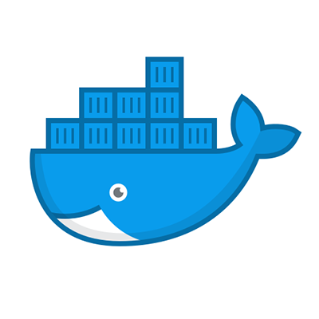

# Docker 

Docker is an open platform for developing, shipping, and running applications. It allows you to separate your
applications from your infrastructure so you can deliver software quickly. You can significantly reduce the delay
between writing code and running it in production.

The Docker platform has two distinct components: the **Docker Engine** (which is responsible for creating and running
containers); and the **Docker Hub** (a cloud service for distributing containers). Docker took the existing Linux
container technology to create a complete solution for the creation and distribution of containers.

## Brief History

* **2001**: SWsoft (now Parallels, Inc.) released the commercial Virtuozzo container technology for Linux and later open
  sourced the core technology as OpenVZ in 2005.
* **2008**: The Linux Containers (LXC) project started and brought together CGroups, kernel namespaces, and chroot
  technology (among others) to provide a complete containerization solution.
* **2013**: Docker brought the final pieces to the containerization puzzle, and the technology began to enter the
  mainstream.

## How to install/use

Download instructions are here: **[docker.com.](https://www.docker.com/products/docker-desktop)**

Once you have Docker installed, open up a command prompt and run:
   
    docker run -d -p 80:80 docker/getting-started

## How Docker improves productivity

Developing apps today requires so much more than writing code, including multiple languages, frameworks, and
architectures. Docker simplifies and accelerates your workflow. It introduced the industry standard for containers,
which allow developers to isolate their app from its environment. This solves the “it works on my machine” headache.

Docker offers fast and consistent delivery of your applications using containers that provide your application and
services. Docker containers can run on a developer’s local laptop, on physical or virtual machines in a data center, on
cloud providers, or in a mixture of environments.

Docker also provides a viable, cost-effective alternative to hypervisor-based virtual machines. It is perfect for high
density environments and for small and medium deployments where you need to do more with fewer resources.
