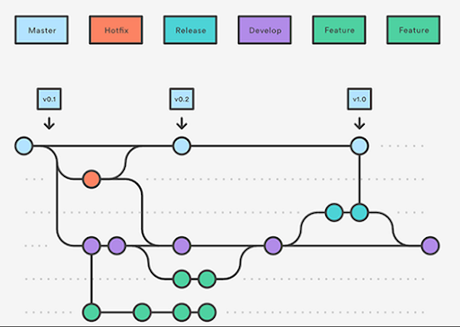

# GitFlow

**GitFlow** is a *branching model* for Git created by Vincent Driessen.

## Key Benefits

**Parallel Development**

GitFlow makes parallel development very easy, by isolating
new development from finished work. New development (such as features and non-emergency bug fixes) is done in feature
branches, and is only merged back into main body of code when the code inside the branch is ready for release.

**Collaboration**

Feature branches also make it easier for multiple developers to collaborate on the same feature. Each feature branch becomes a sandbox where the only
changes are made it to get the new feature working. It is very easy to follow what each
collaborator is doing.

**Support For Emergency Fixes**

GitFlow supports **hotfix branches**, which are branches made from a tagged release. You can use these branches to make an
emergency change, knowing that the hotfix will contain only your fixes. There’s no risk that
you’ll accidentally merge in new development at the same time.

# How Gitflow Works

Any new development, or new features, are built in **feature branches**.

**Feature branches** are branched off of the **develop branch**. Finished features or any fixes are merged back into the
develop branch when they’re ready for release.

When it is time to make a release, a release branch is created off of the develop branch.

The code in the release branch is deployed into a test environment where any problems are fixed directly
in the release branch. This cycle: **deploy -> test -> fix -> redeploy ->** continues until the team is happy that the
release will satisfy customers. 

When the release is finished, the release branch is merged into master(or main) and to develop. This makes sure that any changes made in the release branch aren’t accidentally lost by new
development. 

The master(or main) branch tracks released code only. The only commits to master are merges from release branches
and hotfix branches. 

Hotfix branches are used to create emergency fixes.

They are branched directly from a tagged release in the master branch, and when finished are merged back into both
master and develop to make sure that the hotfix isn’t accidentally lost when the next regular release occurs.
 
*The below image gives you a good look at how the Gitflow cycle functions.*

