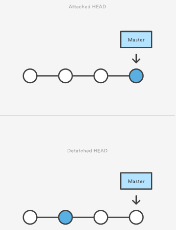

# Checkout

The `git checkout` command can switch between branches, but it can also be used to restore files.

## How to use

### Checkout an existing branch

The most common use case for `git checkout` command is when we want to switch to a different branch, making it the new
HEAD branch.

    $ git checkout <branch-name>

### Checkout a new branch

`Git checkout` command accepts -b argument, and thanks to this fact we can create a new branch and immediately switch to
it.

    $ git checkout -b <new-branch-name>

## Be cautious with detached HEAD

When we `checkout` a commit, we get into a detached HEAD state. It looks like this.

It is important not to start developing a new feature in this state because you will not have reference to
your new commits.
