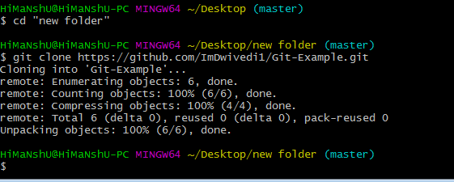

# Clone 
Git clone creates a local copy of a project that already exists remotely. The clone includes all the project’s files, history, and branches.

## Command to Clone an Existing Repository

If you want to get a copy of an existing Git repository:

    $ git clone

Every version of every file for the history of the project is pulled down by default when you run git clone. In fact, if your server disk gets corrupted, you can often use nearly any of the clones on any client to set the server back to the state it was in when it was cloned

You clone a repository with git clone <url>. For example, if you want to clone the Git linkable library called libgit2, you can do so like this:

    $ git clone https://github.com/libgit2/libgit2

That creates a directory named libgit2, initializes a .git directory inside it, pulls down all the data for that repository, and checks out a working copy of the latest version.

