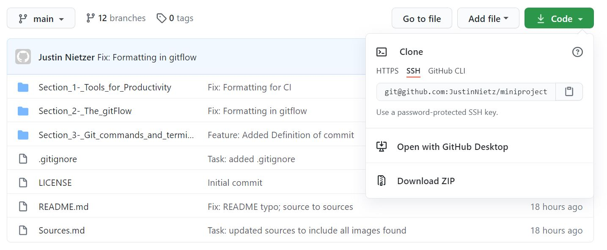

# Clone

Git **Clone** creates a *local copy* of a project that already exists remotely. The clone includes all the project’s
files, history, and branches.

## Command to Clone an Existing Repository on Github

If you want to get a copy of an existing Git repository:

    $ git clone 'project_on_github'

*Every version of every file for the history of the project* is pulled down by default when you run git clone. In fact,
if your server disk gets corrupted, you can often use nearly any of the clones on any client to set the server back to
the state it was in when it was cloned.

You clone a repository with git clone <url>.

There are multiple ways to clone an existing a repository through Github. You can use the **HTTPS** option, the
**SSH key** option, or through **Github's CLI**.

The easiest way would be to use the HTTPS, but it is *more secure* to clone the project with an SSH key.

Please use the guide
found **[here](https://docs.github.com/en/github/authenticating-to-github/generating-a-new-ssh-key-and-adding-it-to-the-ssh-agent)**
to set up a SSH key for Github.

