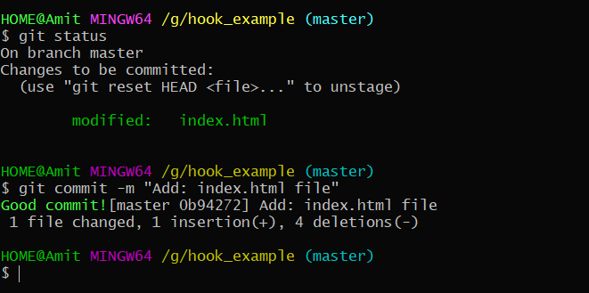

# Commit

The git commit command captures a snapshot of the project's currently staged changes. Committed snapshots can be thought
of as “safe” versions of a project—Git will never change them unless you explicitly ask it to.

Prior to the execution of git commit, The git add command is used to promote or 'stage' changes to the project that will
be stored in a commit. These two commands git commit and git add are two of the most frequently used.

## What the command is

    $ git commit

## Other options you can use

    git commit -a

Commit a snapshot of *all changes* in the working directory. This only includes modifications to tracked files (those that
have been added with git add at some point in their history).

    git commit -m "commit message"

A shortcut command that *immediately creates a commit with a passed commit message*. By default, git commit will open up
the locally configured text editor, and prompt for a commit message to be entered. Passing the -m option will forgo the
text editor prompt in-favor of an inline message.

    git commit -am "commit message"

A power user shortcut command that combines the -a and -m options. This combination immediately creates a commit of *all
the staged changes and takes an inline commit message*.

    git commit --amend

This option adds another level of functionality to the commit command. Passing this option will modify the last commit.
Instead of creating a new commit, staged changes will be added to the *previous commit*. This command will open up the
system's configured text editor and prompt to change the previously specified commit message.

