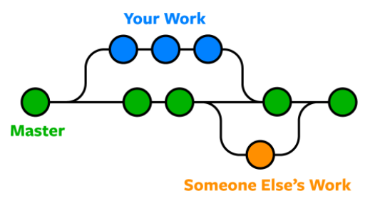
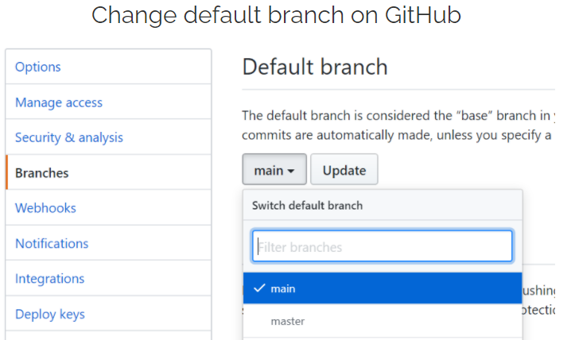

# Master Branch

In Git, `master` is a naming convention for a branch. After cloning a project from a remote repository, the resulting
local repository will have a single local branch: the so-called `master` branch by default. A `master` branch needs to
run smoothly all the time, so we cannot add a broken code to it. To avoid this when we are working on a new feature, we
should branch off `master` branch and work on another branch separately. After testing the new feature, we can
run `git merge` to include the new feature on `master` branch.

## Process of renaming `master` to `main`

After using `master` as default branch for a long time, Git and the developer community decided that this master/slave
terminology needs to be replaced. There were a couple of alternatives considered like `default` and `primary`, but the
final choice became `main`. Therefore, from now on any new repositories are being created on Git, GitHub will be
called `main`; already existing `master` branches are under a renaming process too.

