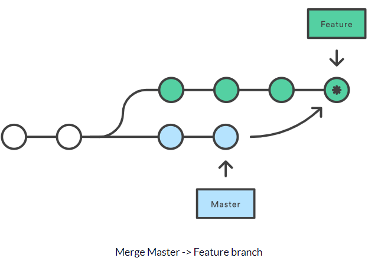

# Merge

The purpose of `git merge` is to integrate changes from multiple branches into one. In essence, merge command takes the
contents of a source branch and integrates them with a target branch. During this process, the target branch will be
changed, however, the source branch history will remain the same.

## How to use

Firstly, we need to take some steps before merging.

* We should execute `git status` to point HEAD to the correct merge-receiving branch. If it is necessary, we should
  use `git checkout <receiving branch>` command to switch to the receiving branch.
* Our task is to update both receiving and merging branch with the latest remote changes. After invoking `git fetch` to
  pull the latest commits, we need to ensure the main branch has the latest updates by running `git pull`. After the
  preparation process, we can execute `git merge <branch name>` which is the name of the branch to be merged into the
  receiving branch.
  

## Frequently occurred problem: Merge conflict

Conflicts could happen when two people have changed the same line in a file, or if a developer deleted a file while
another developer was modifying it. When such things occur, Git cannot decide whichever changes to keep. Therefore,
developers are responsible for resolving the problem. The most common way to fix this issue is to edit the file in which
the conflict arose. Besides this, we have a couple more tools to resolve the conflict.

* By executing `git merge --abort`, we will disrupt the merge process and return to the state before trying to merge.
* If we run `git reset`, our files can return to an earlier good state.
