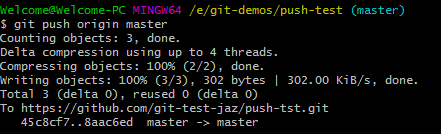

# Push

The `git push` command is used to upload our local repository content to a remote repository. Our purpose with pushing
is to make our commits accessible to others whom we are collaborating with.

## How to use

First, we need to ensure that all our changes to the local repository are already committed. To check whether we still
have changes to commit, we can use `git status` to find out. Furthermore, the best practice is to run `git pull` command
before trying to push our changes. Using `git pull`, we can reduce the amount of merge conflicts. This is how
the `git push` command looks in action. 

    $ git push <repo name> <branch-name>

However, if our branch is newly created, then we also need to upload the branch with the following
command:

    $ git push --set-upstream <remote> <name-of-your-branch>

or  

    $ git push -u origin <branch-name>
